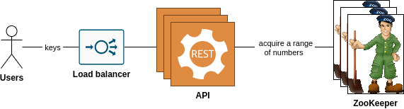

# Task definition
Develop Key Generation Service that generates unique keys with a specific length.
Can be used as part of a solution for TinyURL and other services.

# High-level design
## Counter-based

# Usage
- Run `make up`
- Open in browser Swagger UI http://localhost:8090/
- Initialize counter-based approach http://localhost:8090/#/counter-based/put_counter_based_init
- Generate counter-based keys via http://localhost:8090/#/counter-based/get_counter_based_key

# Development
Please check Makefile and docker-compose.yml for understanding how the solution works under the hood.

# Docker image usage
You can find ready to use docker image on Docker Hub: https://hub.docker.com/repository/docker/ewgra/key_generation_service.

In [docs/docker-compose.sample.yml](docs/docker-compose.sample.yml) file you can find example of usage and customize it for your project.
