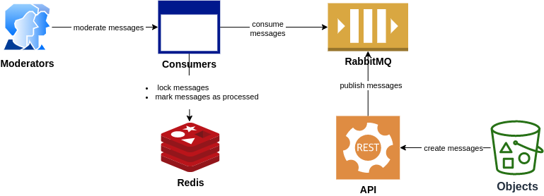
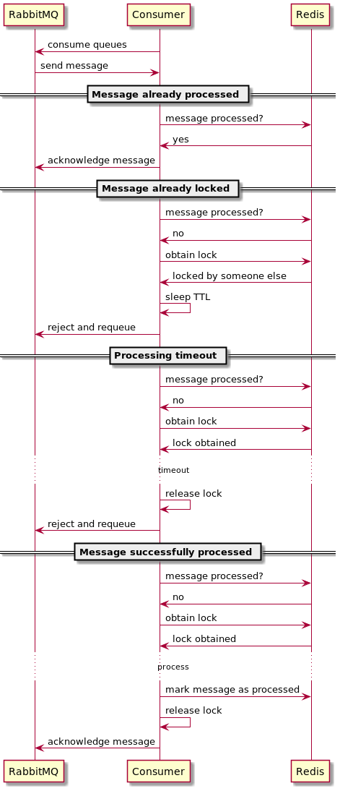

# Task definition
This is proof of concept for the following task:

> We have a stream of objects that should be moderated. Objects can belong to several categories.
Moderators can subscribe to several categories, and we should show objects for moderation only to one moderator.
The moderation process should support timeouts when the moderator lost connection, or similar.

# High-level design

# Consume activity diagram

# Usage
- Run `make up`
- Open in browser Swagger UI http://localhost:8090/
- Create topic http://localhost:8090/#/topic/createTopic
- Create categories for the topic http://localhost:8090/#/topic/createCategory
- Open new terminal and start consumer for the topic and categories: `make start-consumer topic=test_topic categories=test_category1,test_category2`
- Send messages http://localhost:8090/#/topic/createMessage
- Create more consumers in case of needs and send more messages