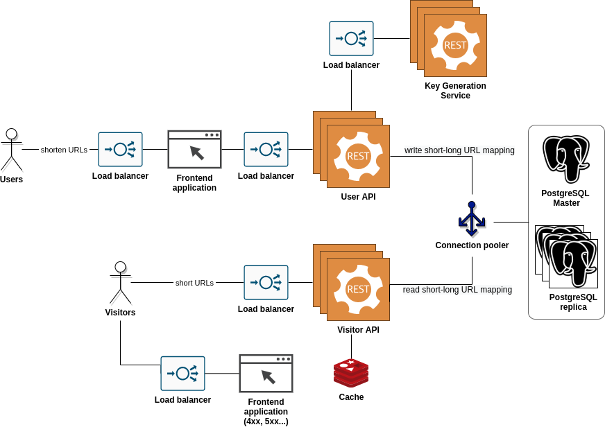

// FIXME XXX: ci
// FIXME XXX: cypress tests?

# Task definition
Develop URL shortening web service, which provides short aliases for redirection of long URLs.

###Functional requirements:

- User needs to be able to enter long url. Our service should save that url and generate a short link.
- Clicking on the short link our service should redirect the user to original long url.
- User should have the option to enter the expiration date. After that date passed, short link should be invalid.*
- Users should create an account to use service. Service can have usage limit per user.*
- User is allowed to create his own short link.*
- Service should have metrics, for example, most visited links.*

*\* nice to have, out of the scope of the current implementation*

# High-level design

**Implementation of Key Generation Service** you can find here: https://github.com/ewgRa/test_tasks/tree/master/system_design/key_generation_service. Since this component can be reused in many other applications - we implemented it as a standalone service.

**Rate limiting** should be considered for Shorten API and Visitor APP. It is up to the developer on how to implement it. If your Load Balancer supports rate limiting - it is the best option. Otherwise, you can implement it on the application level (Bucket4j, Resilience4j, Google Guava, etc.).

As **database** you can use any high available storage, since the uniqueness of keys guaranteed by Key Generation Service.

# Usage
- Run `make up`
- Open new terminal and run `make init`
- Open in browser http://localhost:8080/