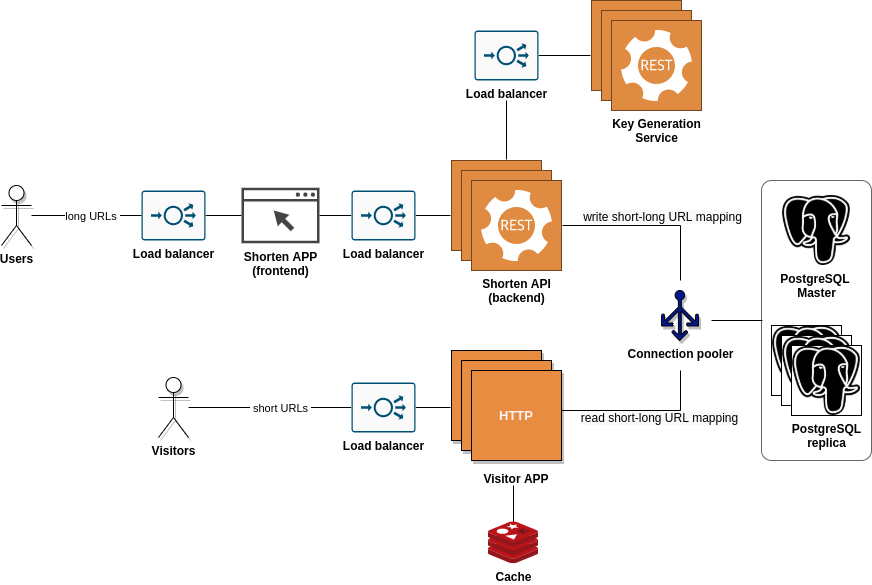

// FIXME XXX: rate limiter -> LoadBalancer, etc - show on highlevel design diagramm
// FIXME XXX: ci
// FIXME XXX: tests

# Task definition
Develop URL shortening web service, which provides short aliases for redirection of long URLs.

# High-level design
! NOTE: Implementation of Key Generation Service you can find here: 

# Usage
FIXME XXX
